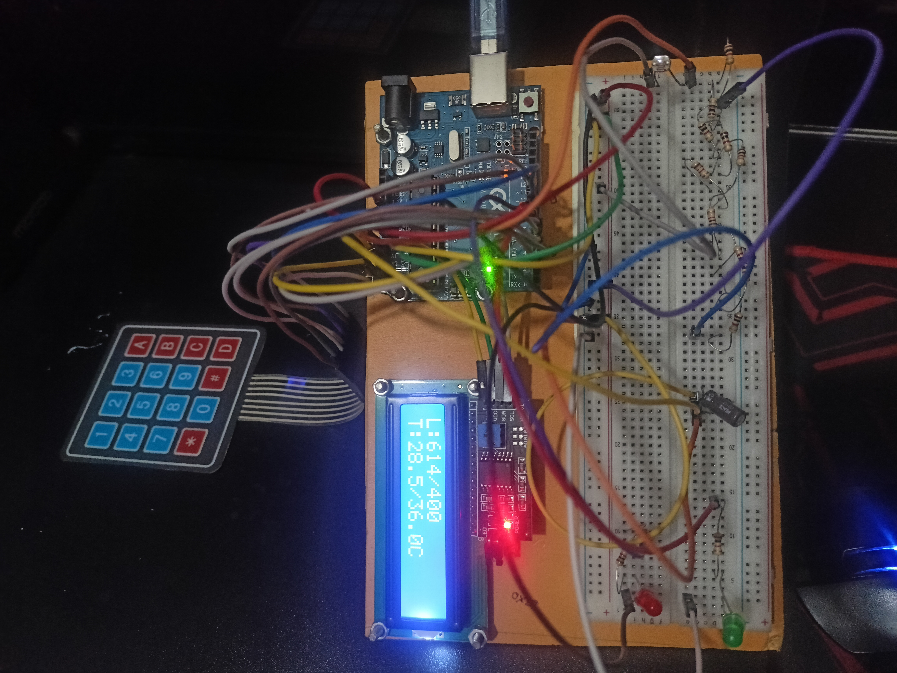
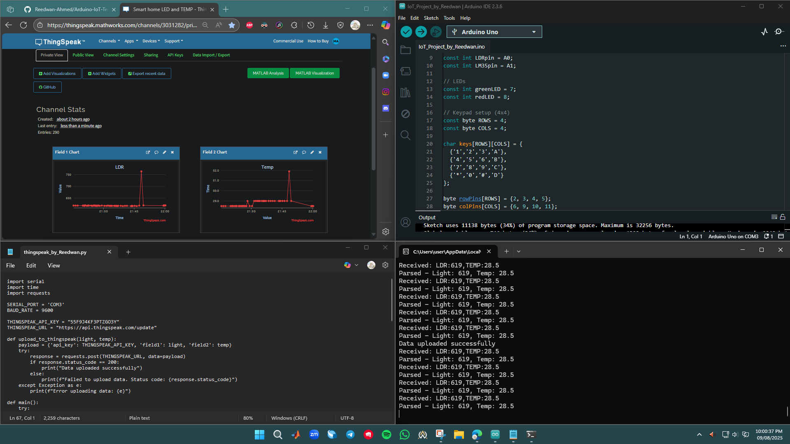

# Arduino-IoT-Temperature-Light-Monitoring System
“My Personal Project: IoT project using Arduino UNO with LDR and LM35 sensors, keypad for threshold setting, data upload to ThingSpeak using Python.”

## What it does  
- Measures light intensity and temperature  
- Allows you to set custom thresholds via keypad  
- Shows live readings and thresholds on a 16x2 LCD  
- Sends data to ThingSpeak online platform using Python running on a PC connected via USB  

## Why I made this  
I wanted to build a real IoT system with what I have: no extra modules, just Arduino, sensors, and my PC as a challenge and the result is perfect.

## Project Gallery  

  
  
  

##My YouTube video:https://youtu.be/ud7cvmcG3-s?si=15sxBfWfZDalmXrB
## How It Works

### Sensor Reading and Display
- The Arduino reads data from two sensors:  
  - **LDR Sensor** (Light Dependent Resistor) measures ambient light level (analog input **A0**).  
  - **LM35 Temperature Sensor** measures temperature in Celsius (analog input **A1**).  
- The Arduino averages multiple sensor readings to obtain stable values.  
- It displays the current sensor values and threshold settings on the **16x2 LCD**.

### LED Indicators
- **Green LED** lights up when the ambient light level is **below the light threshold** (indicating darkness). This acts as a light status indicator.  
- **Red LED** lights up when the temperature **exceeds the temperature threshold**, indicating a high temperature condition.

### Threshold Setting via Keypad
- Press **‘A’** on the keypad to enter threshold setting mode.  
- Choose which threshold to change:  
  - Press **‘1’** for light threshold  
  - Press **‘2’** for temperature threshold  
- Input the new value using the keypad (up to 4 digits).  
- Press **‘#’** to confirm and save the new threshold or **‘*’** to cancel and exit without changes.  
- Updated thresholds immediately affect LED behavior and LCD display.

### Python Script Functionality
- The Python script continuously listens to the serial port and reads incoming sensor data.  
- It parses light and temperature values from the serial messages.  
- The script uploads the latest sensor readings to **ThingSpeak** every **15 seconds**, respecting ThingSpeak’s free-tier update limit (one data point per 15 seconds).  
- Although uploads happen every 15 seconds, the script reads data from Arduino every **0.1 seconds** to keep sensor values updated and ready for upload.

### ThingSpeak IoT Integration
- ThingSpeak stores the sensor data in the cloud, allowing remote monitoring through its dashboard.  
- This enables real-time IoT monitoring using only your Arduino, PC, and Python script — no extra hardware required.

## Components Used
- **Arduino Uno R3** (Main controller)
- **16x2 I2C LCD Display** (To show readings)
- **4x4 Matrix Keypad** (For input)
- **LDR (Light Dependent Resistor) Sensor** (To measure light intensity)
- **LM35 Temperature Sensor** (To measure temperature)
- **Green and Red LEDs** (To indicate status)
- **Resistors** (Typically 220Ω for LEDs)
- **Breadboard and Jumper Wires** (To connect all components)
- **USB Cable** (To connect Arduino to PC)

##Hardware Setup:
  ## Hardware Connection Steps

### Step 1: Connect the LCD Display
The I2C LCD has 4 pins: GND, VCC, SDA, SCL.

- Connect **GND** to Arduino **GND**  
- Connect **VCC** to Arduino **5V**  
- Connect **SDA** to Arduino **A4** pin  
- Connect **SCL** to Arduino **A5** pin  

---

### Step 2: Connect the 4x4 Keypad
The keypad has 8 wires: 4 rows and 4 columns.

- Connect the **row pins** to Arduino digital pins: **2, 3, 4, 5**  
- Connect the **column pins** to Arduino digital pins: **6, 9, 10, 11**  

> *(You can check which wire is which by testing or referring to the keypad datasheet.)*

---

### Step 3: Connect the Sensors

**LDR (Light Dependent Resistor):**

- Connect one leg to **5V**  
- Connect the other leg to Arduino **A0** (analog input) through a voltage divider (usually with a resistor, e.g., 10kΩ) to **GND**  

**LM35 Temperature Sensor:**

- Pin 1 to **5V** (VCC)  
- Pin 2 to Arduino **A1** (analog input)  
- Pin 3 to **GND**  

> **Important:** Also connect a 0.1µF capacitor between pin 2 (+ve leg) and pin 3 (-ve leg) of LM35 to ensure proper operation.

---

### Step 4: Connect LEDs

**Green LED:**

- Connect the longer leg (anode) to Arduino pin **7** through a **220Ω** resistor  
- Connect the shorter leg (cathode) to **GND**  

**Red LED:**

- Connect anode to Arduino pin **8** through a **220Ω** resistor  
- Connect cathode to **GND**  

---

### Step 5: Setting Up Python and ThingSpeak for IoT Data Upload

Open your terminal or command prompt and run:
pip install pyserial requests

-Use a USB cable to connect your Arduino.
-Find the COM port number (e.g., COM3) from Device Manager or Arduino IDE.
-Configure Python Script
-Update the SERIAL_PORT variable in the Python code with your Arduino’s COM port.
-Replace the ThingSpeak WRITE_API_KEY with your channel’s write API key.
-Run the Python Script
-Execute the Python file. It will:
1.Read sensor data sent from Arduino via serial.
2.Parse the light and temperature values.
3.Upload data to ThingSpeak every 15 seconds.
-Check Data on ThingSpeak:
Log in to your ThingSpeak account and open your channel dashboard to see live sensor readings updating online.

## How to run  
- Upload Arduino code from `/Arduino/IoT_Project_by_Reedwan.ino`  
- Run Python script `/Python/thingspeak_by_Reedwan.py` after connecting Arduino via USB  (
- Visit your ThingSpeak channel to see live updates  
- The I2C LCD shows L(light):real value/Threshold value and T(Temp):real value/Threshold value in real time.
